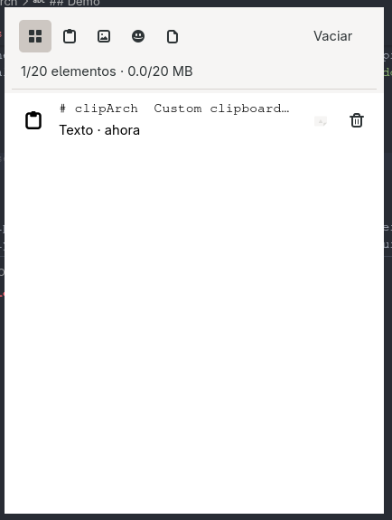

# clipArch

Custom clipboard manager for text and images on Arch Linux. Works with GNOME and Hyprland.

## Features

* 📋 Text clipboard history
* 🐧 Native GTK4 integration (uses `Gdk.Clipboard` directly, no polling)
* 🪟 Wayland-first, with `gtk4-layer-shell` support for Hyprland
* 🔄 Runs as a systemd user service — restarts itself if it crashes
* ⚡ Toggle window visibility instantly via `SIGUSR1`
* 🖥️ Works out of the box on GNOME/Wayland (falls back to a plain floating window, since GNOME's Mutter doesn't support layer-shell)

## Requirements

* Arch Linux (or derivative)
* Python 3
* GTK4 + PyGObject
* `gtk4-layer-shell` (for Hyprland's layered popup — optional on GNOME)
* `wl-clipboard` (`wl-copy`, used for writing content back to the clipboard on paste)
* `ydotool` (optional — simulates the paste keystroke)
* systemd (user session)

## Installation

```bash
# clone the repo
git clone https://github.com/teddyBear-zsh/teddy-tools.git
cd teddy-tools/clipArch

# install dependencies
sudo pacman -S python-gobject gtk4 gtk4-layer-shell wl-clipboard ydotool

# run the installer
./install.sh
```

`install.sh` copies the app to `~/.local/bin/clipboard-manager`, installs a systemd user service (`clipboard-manager.service`), and — on GNOME — sets up a `SUPER+V` custom keybinding automatically via `gsettings`. On Hyprland, it adds the equivalent bind to your `hyprland.conf`.

Check it's running with:

```bash
systemctl --user status clipboard-manager.service
```

## Usage

Once the service is running, toggle the clipboard manager window with:

```bash
pkill -SIGUSR1 -f main.py
```

`install.sh` already binds this to `SUPER+V` for you — you shouldn't need to run it manually unless you're setting up a keybind by hand.

### Example Hyprland keybind

```
bind = SUPER, V, exec, pkill -SIGUSR1 -f main.py
```

## How it works

clipArch listens to clipboard changes natively through GTK4's `Gdk.Clipboard` API instead of polling or shelling out to `wl-paste --watch`, which keeps resource usage minimal and sidesteps a real limitation: GNOME's Mutter doesn't implement the `wlr-data-control` protocol that `wl-paste --watch` depends on, so that approach silently fails there. Reading clipboard changes through GDK works on any Wayland compositor GTK supports.

It runs in the background as a systemd user service (auto-restarting on crash), and the UI window is toggled on demand via a `SIGUSR1` signal sent to the running process — ideal for binding to a hotkey, since it avoids spawning a new process (and the launch-animation flicker that comes with it) on every keypress.

On Hyprland, the window is rendered using `gtk4-layer-shell` for proper Wayland layer-shell integration. On GNOME, it falls back to a regular floating `Gtk.ApplicationWindow`, since Mutter doesn't implement layer-shell.

## Demo
[](assets/demo.mp4)

Watch the demo: [assets/demo.mp4](assets/demo.mp4)

## Roadmap

* [ ] Image clipboard capture — the card UI already supports rendering image entries and type filters; the watcher only wires up `read_text_async` right now, image capture via `Gdk.Clipboard` still needs to be added
* [ ] File/URI clipboard support (copying files in a file manager)
* [ ] AUR package for easier install (skip the manual `pacman -S` + `./install.sh` steps)
* [ ] Config file for keybind/theme customization, instead of editing `gsettings`/`hyprland.conf` by hand
* [ ] Search/filter within clipboard history

## License

MIT